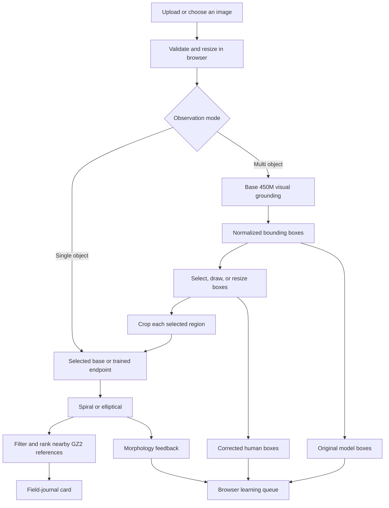

# Cosmic Detective

Cosmic Detective is an experimental galaxy-morphology explorer. Choose a Galaxy
Zoo image or upload an observation, then inspect a central target or ask a
compact vision-language model to map multiple objects across the field. The app
can compare base and morphology-tuned checkpoints, collect human corrections,
and save successful classifications as field-journal cards with nearby
reference images.

The project is a playful take on Galaxy Zoo and related citizen-astronomy
challenges. It explores how effectively a compact 450M vision-language model can
be specialized for a focused scientific task while making its inference speed,
latency, and throughput visible. It also considers a longer-term possibility:
running capable small models closer to where observations are made, including
smart telescopes and future space-observation pipelines.

The current morphology classifier answers one deliberately narrow question:
does a selected galaxy crop look **spiral** or **elliptical**? In single-object
mode that crop is the central target. In multi-object mode, the base model first
proposes regions and the classifier reads each selected crop. These answers
describe visible morphology. They do not identify a unique astronomical object,
establish a physical galaxy type, or replace scientific analysis.

## Features

- Explicit, user-triggered inference against base and tuned checkpoints
- Single-object and multi-object observation modes
- Zero-shot visual grounding with normalized, selectable bounding boxes
- Two-stage multi-object inference: locate sources, then classify each crop
- Human box correction through exclusion, manual drawing, and corner resizing
- Per-request latency, time-to-first-token, decode time, and token counts
- Galaxy Zoo 2 vote summaries for known reference objects
- Five morphology-filtered visual candidates for further inspection
- Morphology stress tests across rotation, dimming, noise, compression, and crop
- Browser-local morphology and grounding feedback queue
- Checkpoint-approval and continual-learning pipeline preview
- Browser-local field journal with JSON export
- Optional shuffle across a locally prepared 239,000-object catalog

Inference is connected through internal harness tooling. Public integration
guidance is coming soon; the server route currently expects an OpenAI-compatible
vision chat-completions endpoint.

## Models

Both sides of the comparison use
[LiquidAI/LFM2.5-VL-450M](https://huggingface.co/LiquidAI/LFM2.5-VL-450M), a
compact vision-language model with an LFM2.5-350M language backbone and an 86M
SigLIP2 NaFlex vision encoder.

| Mode | Model | Purpose |
| --- | --- | --- |
| Base 450M | Original LFM2.5-VL-450M checkpoint | Zero-shot morphology and multi-object visual grounding |
| Trained 450M | LoRA adapter post-trained over the same checkpoint | Galaxy Zoo 2 spiral/elliptical classification |

The post-training corpus contains 12,000 balanced Galaxy Zoo 2 examples: 6,000
spiral and 6,000 elliptical. Each example pairs a galaxy image and classification
instruction with one expected lowercase label. The labels are grounded in the
top-level Galaxy Zoo 2 volunteer vote tree. The SFT recipe used three epochs, an
effective batch size of 16, a learning rate of `5e-4`, and LoRA rank 8.

On the same frozen, object-disjoint set of 400 images, the base model scored
7.79/10 and the post-trained model scored 9.98/10 using unconstrained decoding
and the same vision-judge protocol. These scores measure agreement with the
requested label and output format under this experiment. They are not calibrated
probabilities, scientific accuracy claims, or evidence that the model can
identify a unique catalog object.

The app connects to separately configured base and trained serving endpoints.
It does not ship or download either checkpoint. The model's own license and use
terms remain available on its model card.

## Architecture



The browser validates and downsizes the image before sending it through the
application server. Single-object inference sends the full observation to the
chosen endpoint, which returns exactly `spiral` or `elliptical`. That label
filters a local Galaxy Zoo 2 reference catalog, and a small 16x16 grayscale
descriptor ranks candidates within the matching morphology. An exact SHA-256
match recognizes a reference image already present in the catalog.

Multi-object inference has two deliberate stages. First, the base 450M model is
prompted for every visible galaxy candidate as a JSON array of bounding boxes
normalized to `[0,1]`. The app draws those predictions and lets the observer
exclude a region, add a square, or resize any box by its corners. Second, the app
crops every selected region and sends the crops one at a time to the chosen base
or trained morphology endpoint. Changing tabs does not interrupt this sequence.
The boxes are model proposals rather than catalog-confirmed detections.

The candidate ranker is a transparent image-distance heuristic, not a learned
embedding model. Its five results are visually similar references rather than
claims that the uploaded galaxy is the same astronomical object. Object IDs,
coordinates, vote summaries, and descriptions come from the reference catalog;
the vision model supplies the morphology label. Saved cards remain in browser
local storage.

The Stress Lab deliberately reruns the selected model over transformed versions
of one observation and reports label stability. Confirmed classifications,
human corrections, uncertain cases, stress-test failures, and visual-grounding
annotations can be added to a browser-local learning queue. A grounding record
preserves both the original zero-shot boxes and the corrected target boxes. The
Learning Loop visualizes validation, dataset snapshotting, training, evaluation,
and promotion stages. Its progress displays are explicitly simulated and do not
submit cloud training jobs.

## Run locally

Requirements: Node.js 22.13 or newer.

```sh
cd apps/web/client
npm install
cp .env.example .env.local
npm run dev
```

Set the four server-only variables in `.env.local`:

```dotenv
COSMIC_INFERENCE_BASE_URL=https://your-inference-host.example/v1
COSMIC_BASE_MODEL=your-base-model
COSMIC_TRAINED_MODEL=your-trained-model
COSMIC_INFERENCE_KEY=your-server-key
```

Never expose the inference key through a browser-prefixed environment variable.
Image uploads are resized in the browser and sent through the application server
to the configured inference endpoint. The app does not persist uploads;
collections stay in the browser's local storage.

The base deployment also serves multi-object grounding. Development or debug
deployments may scale down while idle, so the first streamed request can take
longer than subsequent warm requests.

## Data

Bulk survey data, generated catalogs, model weights, training runs, and local
experiment records are intentionally excluded from version control. After
obtaining the Galaxy Zoo 2 files, the scripts in `pipelines/ingest/` build the
local teaching catalog and full-archive browser index:

```sh
python3 pipelines/ingest/build_web_catalog.py
python3 pipelines/ingest/build_archive_pool.py
```

See [dataset notes](docs/datasets.md) for the expected local layout, source
attribution, and the distinction between source data and project code.

## Development

```sh
cd apps/web/client
npm run lint
npm run build
```

The web client lives in `apps/web/client/`. Data preparation and evaluation code
lives under `pipelines/`, `data_gen/`, `prompts/`, and `evals/`. Local datasets
and experiment outputs are covered by the root `.gitignore`.

## License

Project code is available under the [MIT License](LICENSE). Astronomy images,
catalogs, annotations, model checkpoints, and third-party assets retain their
respective source terms and are not relicensed by this repository.

## Image credit

The interface background is
[“NASA Reveals New Details About Dark Matter’s Influence on Universe”](https://www.flickr.com/photos/nasawebbtelescope/55118095230/)
from NASA’s James Webb Space Telescope photostream. Credit:
NASA/STScI/J. DePasquale/A. Pagan. Licensed under
[CC BY 4.0](https://creativecommons.org/licenses/by/4.0/). The app displays the
image with responsive cropping and a dark color overlay.
