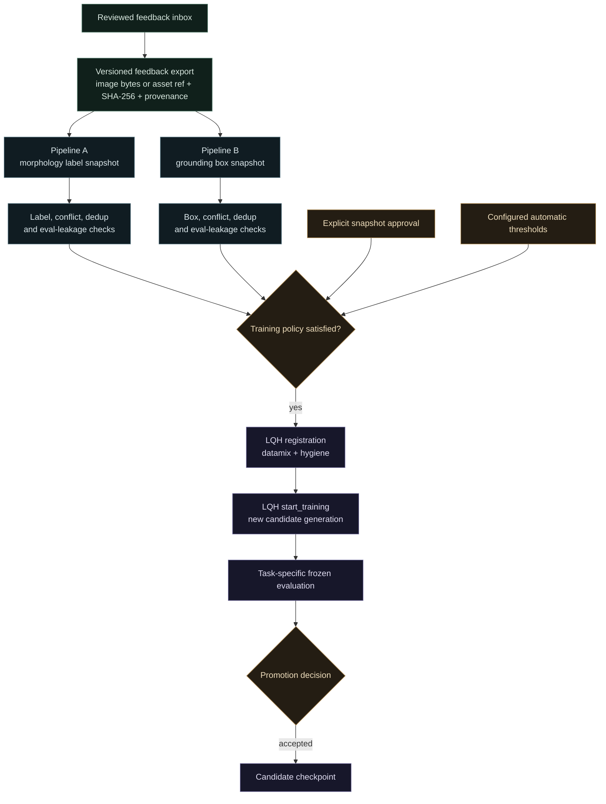

# Learning-loop contract

Cosmic Detective currently visualizes a self-improving observatory, but it does
not submit training jobs. Feedback stays in browser local storage and the
progress bars are simulated. The repository skill at
[`skills/cosmic-learning-loop/SKILL.md`](../skills/cosmic-learning-loop/SKILL.md)
defines the intended handoff without implementing or executing it.

## Intended flow

The two data paths are separate because they teach different outputs:

| Pipeline | Reviewed source | Training target | Candidate purpose |
| --- | --- | --- | --- |
| Morphology | Confirmed or corrected single-object classifications | Exact `spiral` or `elliptical` label | Improve central-galaxy morphology |
| Grounding | Confirmed or corrected multi-object maps | Reviewed normalized galaxy boxes | Improve multi-object localization |

Uncertain feedback remains available for human review but never becomes a
training target. The builders must transform accepted human annotations
deterministically; no VLM or text model fills missing labels or boxes.

## Missing implementation

Before this can run, the app needs an explicit feedback-export action or a
server-side ingest route. A training-grade export must add fields that the
current browser queue does not guarantee:

- schema version and stable feedback-record ID;
- original image bytes or durable immutable asset reference;
- explicit image SHA-256 and dimensions;
- task and source checkpoint version;
- original prediction and explicit reviewed target;
- reviewer or review-session provenance and timestamp.

Two deterministic builders must then validate and package the accepted records
as LQH VLM datasets. They should produce immutable manifests, rejection and
conflict reports, class or box distributions, and hashes of the exact rows sent
to training.

## Approval and automatic mode

Manual mode requires approval of a concrete dataset snapshot, not a changing
inbox. Automatic mode requires recorded thresholds for eligible example count,
class or scene coverage, conflict rate, validation success, evaluation
readiness, and budget. Reaching an inbox count by itself is not enough to start
training.

After either policy passes, LQH should register the dataset, build the datamix,
run contamination hygiene, and create a new candidate checkpoint from an
immutable parent. Training completion does not imply promotion. The candidate
must beat or match its parent on the frozen evaluation for the task it changes.

Morphology and grounding may eventually share one multi-task checkpoint. That
choice should wait until a single candidate can be evaluated against both the
existing GZ2 classification suite and a reviewed grounding suite, so gains in
one task cannot hide regressions in the other.
